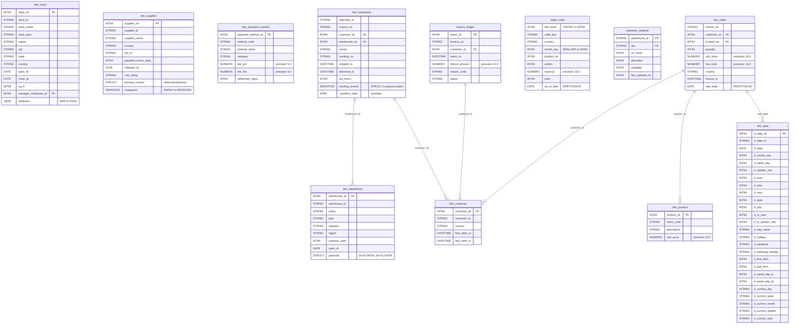

# Locked Decisions for Story 0684eb6f-913a-40be-a612-a9a833254240

## Implementation Approach
## Implementation Approach: Generate BigQuery DDL for 52 Tables + 11 Views

### Output Structure
Following the established pattern in `ddl/acme-lake-prod/`, create a parallel directory:
```
ddl/acme-analytics-prod/
├── 00-create-datasets.sql          -- CREATE SCHEMA retail (US region)
├── 00-apply-all.sql                -- Master apply script
├── README.md
└── retail/
    ├── dim_date.sql
    ├── dim_customer.sql
    ├── ... (52 table files + 11 view files)
    └── vw_panel_continuity_score.sql
```

One `.sql` file per table/view, matching the `acme-lake-prod/raw/*.sql` convention (lowercase table name, comment header documenting source file, storage format, type mappings applied).

### DDL Generation Rules (Mechanical Application)

**Type Mappings (applied universally):**

| Hive/Kudu Type | BigQuery Type | Rule |
|---|---|---|
| `BIGINT` | `INT64` | Direct |
| `INT` | `INT64` | Direct |
| `TINYINT` | `INT64` | R6 NARROW_INT |
| `SMALLINT` | `INT64` | R6 NARROW_INT |
| `STRING` | `STRING` | Direct |
| `BOOLEAN` | `BOOL` | Direct |
| `DATE` | `DATE` | Direct |
| `TIMESTAMP` | `DATETIME` | Hive TIMESTAMP has no timezone; BQ DATETIME is the lossless equivalent |
| `DOUBLE` | `FLOAT64` | Direct |
| `DECIMAL(p,s)` | `NUMERIC(p,s)` | Direct (BQ NUMERIC supports up to 38,9; BIGNUMERIC for wider) |
| `MAP<STRING,STRING>` | `JSON` | Per locked decision; confirmed by `dim_store.attributes`, `dim_promotion.eligibility`, `fact_app_clicks.properties`, `fact_loyalty_events.meta` |
| `ARRAY<T>` | `ARRAY<T>` (REPEATED) | `dim_supplier.categories` → `REPEATED STRING`; `dim_promotion.channels` → `REPEATED STRING` |
| `ARRAY<STRUCT<...>>` | `ARRAY<STRUCT<...>>` (REPEATED STRUCT) | `fact_shipments.tracking_events`, `fact_email_engagement.clicks`, `fact_fraud_decisions.rule_signals` |
| `STRUCT<...>` | `STRUCT<...>` | `dim_supplier.primary_contact`, `dim_warehouse.geocode`, `fact_app_clicks.device` |

**Storage/Property Disposition (all dropped):**
- `STORED AS PARQUET` → dropped
- `STORED AS ORC` → dropped
- `STORED AS KUDU` → dropped
- `TBLPROPERTIES ('parquet.compression'=...)` → dropped
- `TBLPROPERTIES ('transactional'='true', ...)` → dropped (BQ supports DML natively)
- `TBLPROPERTIES ('kudu.*')` → dropped
- `PARTITION BY HASH(col) PARTITIONS N` → dropped (Kudu-specific)
- `PRIMARY KEY (...)` → dropped (BQ has no enforced PKs; clustering substitutes)

**Partitioning Strategy:**

| Source Pattern | BQ Translation | Tables |
|---|---|---|
| `PARTITIONED BY (date_col DATE)` | `PARTITION BY date_col` | fact_sales(sale_date), fact_returns(return_date), fact_refunds(refund_date), agg_daily_sales_by_store(sale_date), agg_daily_sales_by_product(sale_date), etc. |
| `PARTITIONED BY (date_col DATE, string_col STRING)` | `PARTITION BY date_col` (drop non-date partition cols, inline them as regular columns) | fact_web_session(event_date — keep; country — inline), bridge_customer_segment(snapshot_date), bridge_promo_eligibility(load_date) |
| `PARTITIONED BY (year INT, month INT, day INT, region STRING)` | Synthetic `PARTITION BY DATE(PARSE_DATE('%Y%m%d', CONCAT(CAST(year AS STRING), LPAD(CAST(month AS STRING),2,'0'), LPAD(CAST(day AS STRING),2,'0'))))` or use a synthetic `_partition_date DATE` column with `PARTITION BY _partition_date` | fact_inventory_movements, fact_shipments, fact_payments |
| `PARTITIONED BY (year INT, month INT)` | Synthetic `_partition_month DATE` with `PARTITION BY DATE_TRUNC(_partition_month, MONTH)` | fact_supplier_invoice_lines, dim_employee_history(eff_from_year) |
| `PARTITIONED BY (snapshot_hour STRING)` | `PARTITION BY DATE(PARSE_DATETIME('%Y%m%d_%H', snapshot_hour))` or synthetic `_partition_date DATE` | agg_hourly_warehouse_kpi |
| `PARTITIONED BY (as_of_date DATE)` | `PARTITION BY as_of_date` | sales_cube |
| No partition (dims, bridges, ACID) | No partition (small tables) | All dim_* (except dim_employee_history), bridge_* (unpartitioned ones), ACID tables |

**Clustering Strategy:**
- `CLUSTERED BY (col) INTO N BUCKETS` → `CLUSTER BY col` (drop bucket count)
- ACID tables with `CLUSTERED BY (col)` → `CLUSTER BY col` (returns_ledger→return_id, acid_customer_address_history→customer_sk, acid_supplier_terms_history→supplier_sk, acid_loyalty_points_ledger→member_id, acid_inventory_adjustments_log→adjustment_id)
- Kudu PRIMARY KEY columns → `CLUSTER BY pk_cols` (inventory_realtime→warehouse_id,sku; kudu_session_state→session_id; kudu_promo_eligibility→customer_id,promo_id; kudu_realtime_price→sku,store_id)

**Multi-Column Partition → Synthetic Partition Column:**
For tables with `PARTITIONED BY (year INT, month INT, day INT, region STRING)`:
1. Inline all original partition columns as regular columns
2. Add a synthetic `_partition_date DATE` column
3. `PARTITION BY _partition_date`
4. Document: ETL must populate `_partition_date = DATE(year, month, day)` on insert

**Kudu Table Renaming:**
- `kudu_inventory_realtime` → `inventory_realtime` (per AC-8 and locked Kudu decision)
- `kudu_session_state`, `kudu_promo_eligibility`, `kudu_realtime_price` → keep names (AC-8 lists them without rename)

### View Translation Rules

| View | Key Translations |
|---|---|
| `vw_daily_sales_by_country` | Green path — minimal changes. Fully qualify table refs to `acme-analytics-prod.retail.*` |
| `vw_weekly_sales_with_running_totals` | Green path — window functions translate directly |
| `vw_customer_lifetime_value` | R8: `DATEDIFF(a,b)` → `DATE_DIFF(a, b, DAY)`. `DATE_FORMAT(d,'yyyy-MM')` → `FORMAT_DATE('%Y-%m', d)` |
| `vw_monthly_cohort_retention` | R8: `DATE_FORMAT` → `FORMAT_DATE`. `MONTHS_BETWEEN` → `DATE_DIFF(a, b, MONTH)`. `to_date(concat(...))` → `PARSE_DATE('%Y-%m-%d', CONCAT(...))` |
| `vw_product_performance` | Green path |
| `vw_session_to_order_attribution` | Cross-project: `raw.mobile_events` → `` `acme-lake-prod.raw.mobile_events` ``. R9: `+ INTERVAL '1' DAY` → `DATETIME_ADD(s.event_ts, INTERVAL 1 DAY)`. Struct access: `s.context.referrer` works natively in BQ. |
| `vw_active_member_panel` | R3: `NDV(member_id)` → `APPROX_COUNT_DISTINCT(member_id)`. `date_sub(current_date(), 30)` → `DATE_SUB(CURRENT_DATE(), INTERVAL 30 DAY)` |
| `vw_sales_rollup_by_region` | R4: `WITH ROLLUP` → `GROUP BY ROLLUP(s.region, s.store_sk)`. `GROUPING__ID` → `GROUPING(s.region) * 2 + GROUPING(s.store_sk)` |
| `vw_category_hierarchy_recursive` | R10: `WITH RECURSIVE` passes through. `UNION ALL` already present — no change needed. |
| `vw_panel_continuity_score` | T4: `normalize_country()` → `normalize_country_js()` (BQ JS UDF). `date_sub(current_date(), 90)` → `DATE_SUB(CURRENT_DATE(), INTERVAL 90 DAY)` |
| `vw_otd_by_carrier_30d` | R9: `+ INTERVAL '48' HOUR` → `TIMESTAMP_ADD(shipped_ts, INTERVAL 48 HOUR)`. `unix_timestamp()` → `UNIX_SECONDS()`. `date_sub` → `DATE_SUB(CURRENT_DATE(), INTERVAL 30 DAY)` |

### Execution Order
DDL must be applied in this order:
1. `00-create-datasets.sql` — create `retail` dataset
2. All `dim_*` tables (no dependencies)
3. All `fact_*` tables (no dependencies on each other, reference dims via FK conventions)
4. All `agg_*`, `bridge_*`, `acid_*`, `returns_ledger`, `sales_cube`, `top_countries_daily` tables
5. All `inventory_realtime`, `kudu_*` tables
6. UDFs (normalize_country_js — prerequisite for vw_panel_continuity_score)
7. All `vw_*` views (depend on tables + UDFs)

### Fully Qualified Naming
All DDL uses backtick-quoted project-dataset-table format:
`` `acme-analytics-prod.retail.fact_sales` ``
Cross-project references use:
`` `acme-lake-prod.raw.mobile_events` ``

## Data Mapping
## Data Mapping: Hive retail Database → BigQuery `acme-analytics-prod.retail`

All 52 tables and 11 views from the Hive `retail` database map 1:1 into the BQ `acme-analytics-prod.retail` dataset. No tables are split or merged. Column-level type conversions follow locked project rules. Below is the complete mapping.

### ER Diagram (Key Tables)



### Complete Column Mapping (All 52 Tables)

**Dimension Tables (15 tables)**

| Source Table | Target Table | Column Changes | Partition | Cluster |
|---|---|---|---|---|
| retail.dim_date | retail.dim_date | INT cols -> INT64 | none | none |
| retail.dim_customer | retail.dim_customer | TIMESTAMP -> DATETIME (first_seen_ts, last_seen_ts) | none | none |
| retail.dim_product | retail.dim_product | DECIMAL(10,2) -> NUMERIC(10,2) | none | none |
| retail.dim_store | retail.dim_store | INT sq_ft -> INT64; MAP -> JSON (attributes) | none | none |
| retail.dim_supplier | retail.dim_supplier | INT -> INT64 (payment_terms_days); STRUCT preserved; ARRAY STRING -> REPEATED STRING (categories) | none | none |
| retail.dim_employee | retail.dim_employee | all direct mappings | none | none |
| retail.dim_promotion | retail.dim_promotion | ARRAY STRING -> REPEATED (channels); MAP -> JSON (eligibility) | none | none |
| retail.dim_warehouse | retail.dim_warehouse | STRUCT DOUBLE -> STRUCT FLOAT64 (geocode.lat, geocode.lon) | none | none |
| retail.dim_currency | retail.dim_currency | INT minor_unit -> INT64 | none | none |
| retail.dim_geography | retail.dim_geography | DOUBLE -> FLOAT64 (latitude, longitude) | none | none |
| retail.dim_color | retail.dim_color | all direct | none | none |
| retail.dim_size | retail.dim_size | INT sort_order -> INT64 | none | none |
| retail.dim_brand | retail.dim_brand | BOOLEAN -> BOOL | none | none |
| retail.dim_category | retail.dim_category | INT depth,sort_order -> INT64 | none | none |
| retail.dim_payment_method | retail.dim_payment_method | INT settlement_days -> INT64 | none | none |

**Fact Tables (17 tables)**

| Source Table | Target Table | Key Column Changes | Partition | Cluster |
|---|---|---|---|---|
| retail.fact_sales | retail.fact_sales | INT quantity -> INT64; TIMESTAMP -> DATETIME (invoice_ts) | sale_date (DATE) | customer_sk |
| retail.fact_web_session | retail.fact_web_session | TIMESTAMP -> DATETIME; country inlined from partition to regular column | event_date (DATE) | none |
| retail.fact_inventory_movements | retail.fact_inventory_movements | INT quantity -> INT64; add synthetic _partition_date DATE; year/month/day/region inlined as regular columns | _partition_date | sku |
| retail.fact_inventory_snapshot | retail.fact_inventory_snapshot | INT cols -> INT64; TIMESTAMP -> DATETIME | snapshot_date (DATE) | sku |
| retail.fact_returns | retail.fact_returns | INT quantity -> INT64; TIMESTAMP -> DATETIME | return_date (DATE) | none |
| retail.fact_payments | retail.fact_payments | TIMESTAMP -> DATETIME; add synthetic _partition_month DATE; post_year/post_month/payment_method_partition inlined | _partition_month | invoice_no |
| retail.fact_shipments | retail.fact_shipments | TIMESTAMP -> DATETIME; ARRAY STRUCT TIMESTAMP -> ARRAY STRUCT DATETIME (tracking_events); add synthetic _partition_date; ship_year/ship_month/ship_day/carrier_partition inlined | _partition_date | warehouse_sk |
| retail.fact_refunds | retail.fact_refunds | TIMESTAMP -> DATETIME | refund_date (DATE) | none |
| retail.fact_app_clicks | retail.fact_app_clicks | TIMESTAMP -> DATETIME; MAP -> JSON (properties); STRUCT preserved (device); platform_partition inlined | event_date (DATE) | none |
| retail.fact_email_engagement | retail.fact_email_engagement | TIMESTAMP -> DATETIME; ARRAY STRUCT preserved (clicks) | event_date (DATE) | none |
| retail.fact_chat_interactions | retail.fact_chat_interactions | TIMESTAMP -> DATETIME; INT -> INT64; BOOLEAN -> BOOL | start_date (DATE) | none |
| retail.fact_warehouse_picks | retail.fact_warehouse_picks | INT -> INT64; TIMESTAMP -> DATETIME; warehouse_partition inlined | pick_date (DATE) | picker_sk |
| retail.fact_supplier_invoice_lines | retail.fact_supplier_invoice_lines | INT -> INT64; TIMESTAMP -> DATETIME; add synthetic _partition_month; invoice_year/invoice_month inlined | _partition_month | none |
| retail.fact_loyalty_events | retail.fact_loyalty_events | INT points -> INT64; TIMESTAMP -> DATETIME; MAP -> JSON (meta) | event_date (DATE) | none |
| retail.fact_fraud_decisions | retail.fact_fraud_decisions | ARRAY STRING -> REPEATED (rule_signals); TIMESTAMP -> DATETIME | decision_date (DATE) | none |
| retail.fact_promo_redemptions | retail.fact_promo_redemptions | TIMESTAMP -> DATETIME | redemption_date (DATE) | none |
| retail.fact_customer_complaints | retail.fact_customer_complaints | TIMESTAMP -> DATETIME; INT csat_score -> INT64 | created_date (DATE) | none |

**Aggregate Tables (8 tables)**

| Source Table | Target Table | Key Column Changes | Partition | Cluster |
|---|---|---|---|---|
| retail.sales_cube | retail.sales_cube | TINYINT dim_level -> INT64 (R6); SMALLINT month_key -> INT64 (R6) | as_of_date (DATE) | none |
| retail.top_countries_daily | retail.top_countries_daily | TINYINT rank -> INT64 (R6) | none (as_of_date is a regular column) | none |
| retail.agg_daily_sales_by_store | retail.agg_daily_sales_by_store | direct mappings | sale_date (DATE) | none |
| retail.agg_daily_sales_by_product | retail.agg_daily_sales_by_product | direct mappings | sale_date (DATE) | none |
| retail.agg_weekly_customer_ltv | retail.agg_weekly_customer_ltv | INT -> INT64 | week_start_date (DATE) | none |
| retail.agg_monthly_supplier_performance | retail.agg_monthly_supplier_performance | INT -> INT64 | month_start (DATE) | none |
| retail.agg_hourly_warehouse_kpi | retail.agg_hourly_warehouse_kpi | INT -> INT64; add synthetic _partition_date DATE; snapshot_hour inlined as regular STRING column | _partition_date | none |
| retail.agg_daily_carrier_otd | retail.agg_daily_carrier_otd | INT -> INT64 | ship_date (DATE) | none |
| retail.agg_marketing_attribution_cube | retail.agg_marketing_attribution_cube | INT grouping_id -> INT64 | period_date (DATE) | none |
| retail.agg_returns_by_reason_monthly | retail.agg_returns_by_reason_monthly | direct mappings | month_start (DATE) | none |

**ACID Tables (5 tables)**

| Source Table | Target Table | Key Column Changes | Partition | Cluster |
|---|---|---|---|---|
| retail.returns_ledger | retail.returns_ledger | TIMESTAMP -> DATETIME; ORC/transactional dropped | none | return_id |
| retail.acid_customer_address_history | retail.acid_customer_address_history | TIMESTAMP -> DATETIME; BOOLEAN -> BOOL | none | customer_sk |
| retail.acid_supplier_terms_history | retail.acid_supplier_terms_history | INT -> INT64; TIMESTAMP -> DATETIME; BOOLEAN -> BOOL | none | supplier_sk |
| retail.acid_loyalty_points_ledger | retail.acid_loyalty_points_ledger | INT -> INT64; TIMESTAMP -> DATETIME | none | member_id |
| retail.acid_inventory_adjustments_log | retail.acid_inventory_adjustments_log | INT -> INT64; TIMESTAMP -> DATETIME | none | adjustment_id |

**Bridge and SCD-2 Tables (7 tables)**

| Source Table | Target Table | Key Column Changes | Partition | Cluster |
|---|---|---|---|---|
| retail.bridge_product_attribute | retail.bridge_product_attribute | BOOLEAN -> BOOL; INT -> INT64 | none | none |
| retail.bridge_product_supplier | retail.bridge_product_supplier | BOOLEAN -> BOOL; INT -> INT64 | none | none |
| retail.bridge_customer_segment | retail.bridge_customer_segment | direct mappings | snapshot_date (DATE) | none |
| retail.bridge_promo_eligibility | retail.bridge_promo_eligibility | BOOLEAN -> BOOL | load_date (DATE) | none |
| retail.bridge_employee_role | retail.bridge_employee_role | BOOLEAN -> BOOL | none | none |
| retail.dim_employee_history | retail.dim_employee_history | BOOLEAN -> BOOL; add synthetic _partition_year DATE; eff_from_year inlined | _partition_year | none |
| retail.dim_store_history | retail.dim_store_history | INT sq_ft -> INT64; BOOLEAN -> BOOL | none | none |

**Kudu Tables (4 tables)**

| Source Table | Target Table | Key Column Changes | Partition | Cluster |
|---|---|---|---|---|
| retail.kudu_inventory_realtime | retail.inventory_realtime | INT -> INT64; Kudu props dropped | none | warehouse_id, sku |
| retail.kudu_session_state | retail.kudu_session_state | INT cart_items -> INT64; Kudu props dropped | none | session_id |
| retail.kudu_promo_eligibility | retail.kudu_promo_eligibility | BOOLEAN -> BOOL; Kudu props dropped | none | customer_id, promo_id |
| retail.kudu_realtime_price | retail.kudu_realtime_price | Kudu props dropped | none | sku, store_id |

**Views (11 views)**

| Source View | Target View | Key Translation Rules Applied |
|---|---|---|
| vw_daily_sales_by_country | vw_daily_sales_by_country | Green path. Fully qualify refs. |
| vw_weekly_sales_with_running_totals | vw_weekly_sales_with_running_totals | Green path. Fully qualify refs. |
| vw_customer_lifetime_value | vw_customer_lifetime_value | R8: DATEDIFF->DATE_DIFF, DATE_FORMAT->FORMAT_DATE |
| vw_product_performance | vw_product_performance | Green path. |
| vw_monthly_cohort_retention | vw_monthly_cohort_retention | R8: DATE_FORMAT->FORMAT_DATE, MONTHS_BETWEEN->DATE_DIFF, to_date(concat)->PARSE_DATE |
| vw_session_to_order_attribution | vw_session_to_order_attribution | Cross-project ref to acme-lake-prod.raw.mobile_events; R9 interval syntax |
| vw_active_member_panel | vw_active_member_panel | R3: NDV->APPROX_COUNT_DISTINCT; date_sub syntax |
| vw_sales_rollup_by_region | vw_sales_rollup_by_region | R4: WITH ROLLUP->GROUP BY ROLLUP; GROUPING__ID->GROUPING bit-mask |
| vw_category_hierarchy_recursive | vw_category_hierarchy_recursive | R10: WITH RECURSIVE pass-through |
| vw_panel_continuity_score | vw_panel_continuity_score | T4: normalize_country->normalize_country_js UDF-in-JOIN |
| vw_otd_by_carrier_30d | vw_otd_by_carrier_30d | R9: INTERVAL syntax; unix_timestamp->UNIX_SECONDS |

### Synthetic Partition Column Convention
For multi-column partitioned tables, the synthetic column naming convention is:
- `_partition_date DATE` for year/month/day decomposed partitions
- `_partition_month DATE` for year/month decomposed partitions
- `_partition_year DATE` for year-only partitions
ETL pipelines must populate these columns. Original partition columns remain as regular columns for backward-compatible queries.

## Validation
## Validation Strategy

### 1. DDL Execution Validation (AC-1)
**Method**: Apply all generated CREATE statements to a BQ scratch dataset (`acme-analytics-prod.retail_scratch`) and verify zero errors.
- Run `00-apply-all.sql` via `bq query --use_legacy_sql=false`
- Script exits with non-zero on any error
- Validate object count: `SELECT COUNT(*) FROM retail_scratch.INFORMATION_SCHEMA.TABLES` = 52 tables + 11 views = 63
- Existing `scripts/validate-bq-ddl.mjs` and `scripts/validate-all-ac.mjs` in the project can be extended to automate this

### 2. Schema Metadata Validation (AC-2 through AC-8, AC-11)
**Method**: For each table with specific AC requirements, query `INFORMATION_SCHEMA.COLUMNS` and `INFORMATION_SCHEMA.TABLE_OPTIONS` to verify:

| AC | Table | Checks |
|---|---|---|
| AC-2 | fact_sales | Partition: sale_date DAY; Cluster: customer_sk; Columns: invoice_no STRING, customer_sk INT64, product_sk INT64, quantity INT64, unit_price NUMERIC(10,2), line_total NUMERIC(14,2), country STRING, invoice_ts DATETIME |
| AC-3 | sales_cube | dim_level INT64 (not TINYINT), month_key INT64 (not SMALLINT), revenue NUMERIC(18,2); Partition: as_of_date |
| AC-4 | fact_shipments | tracking_events mode=REPEATED, type=RECORD; sub-fields ts DATETIME, status STRING, location STRING |
| AC-5 | dim_store | attributes column type = JSON |
| AC-6 | dim_supplier | primary_contact type=RECORD with sub-fields name STRING, email STRING, phone STRING; categories mode=REPEATED type=STRING |
| AC-7 | returns_ledger, acid_customer_address_history, acid_supplier_terms_history, acid_loyalty_points_ledger, acid_inventory_adjustments_log | Standard managed tables (not external); CLUSTER BY on bucketing column |
| AC-8 | inventory_realtime, kudu_session_state, kudu_promo_eligibility, kudu_realtime_price | Managed tables; CLUSTER BY on PK columns; no Kudu TBLPROPERTIES |
| AC-11 | fact_inventory_movements | Synthetic _partition_date exists; partition type=DAY on _partition_date; cluster on sku; year/month/day/region are regular INT64/STRING columns |

**Automation**: Generate a validation SQL script that queries INFORMATION_SCHEMA for each AC and returns PASS/FAIL per check. Extend `scripts/validate-all-ac.mjs` to run these checks programmatically.

### 3. Cross-Project View Validation (AC-9)
**Method**: After creating `vw_session_to_order_attribution`, inspect the view definition:
```sql
SELECT view_definition FROM retail.INFORMATION_SCHEMA.VIEWS
WHERE table_name = 'vw_session_to_order_attribution'
```
Assert the definition contains:
- `` `acme-lake-prod.raw.mobile_events` `` (cross-project reference)
- `` `acme-analytics-prod.retail.dim_customer` ``
- `` `acme-analytics-prod.retail.fact_sales` ``

**Pre-requisite**: The `acme-lake-prod.raw.mobile_events` table must exist and the analytics service account must have `roles/bigquery.dataViewer` on `acme-lake-prod.raw`. If the lake DDL from story P0 (acme-lake-prod) has not yet been applied, the view creation will fail — this is an expected dependency.

### 4. UDF Reference Validation (AC-10)
**Method**: Inspect `vw_panel_continuity_score` view definition and assert it contains `normalize_country_js(` in the JOIN ON clause.
**Pre-requisite**: The `normalize_country_js` JS UDF must be created before this view. UDF creation is part of a separate story but the DDL ordering in `00-apply-all.sql` must place UDFs before views.

### 5. Data-Survival Probes (AC-12, AC-13, AC-14)
These validate type fidelity at the data level, not just schema level.

**AC-12: DECIMAL precision (dim_payment_method.fee_pct)**
- Seed: `CAST('0.123456789012345678' AS DECIMAL(38,18))`
- Source check: Insert into Hive DECIMAL(5,4) column, read back — Hive truncates to DECIMAL(5,4) = `0.1235` (4 scale digits)
- Target check: Insert into BQ NUMERIC(5,4), read back
- Assertion: source read-back equals target read-back exactly
- **Note**: DECIMAL(5,4) can only store 4 decimal places. The seed has 18 digits but both source and target will truncate to 4 scale digits. The AC verifies that truncation behavior matches, not that all 18 digits survive.
- **Alternative interpretation**: If AC-12 intends to verify NUMERIC(38,18) fidelity, test against a BIGNUMERIC column. The validation script should test both: (a) NUMERIC(5,4) truncation parity and (b) a separate BIGNUMERIC(38,18) full-precision test.

**AC-13: TIMESTAMP precision (dim_customer.first_seen_ts)**
- Seed: `TIMESTAMP '2024-03-15 12:34:56.123456789'`
- Hive TIMESTAMP supports nanosecond precision (9 fractional digits)
- BQ DATETIME supports microsecond precision (6 fractional digits)
- **Expected behavior**: Hive stores `12:34:56.123456789` (9 digits). BQ DATETIME stores `12:34:56.123456` (6 digits, truncating nanoseconds).
- **Validation**: Document this as a known precision loss. If exact nanosecond fidelity is required, use BQ TIMESTAMP type instead (also 6 digits — BQ has no nanosecond type). The validation script should: (a) verify microsecond precision is preserved (first 6 fractional digits match), (b) flag the nanosecond truncation as an accepted deviation.

**AC-14: FLOAT64 special values (dim_warehouse.geocode.lat)**
- Seeds: NaN, +Infinity, -0.0, 0.30000000000000004
- BQ FLOAT64 supports NaN, +Inf, -Inf natively
- **Validation**: Insert each seed value, read back, compare bit-for-bit
- `-0.0` check: BQ FLOAT64 preserves IEEE 754 negative zero. Verify `1/val = -INFINITY` for -0.0.
- `0.30000000000000004` check: Verify all 17 significant digits preserved via `CAST(val AS STRING)` comparison
- **Note**: geocode.lat is inside a STRUCT. The probe must insert into the struct field: `STRUCT(seed_val AS lat, 0.0 AS lon)`.

### 6. Edge Cases and Error Handling

| Scenario | Expected Behavior | Validation |
|---|---|---|
| Duplicate CREATE (re-run DDL) | CREATE TABLE statements use `CREATE TABLE` (not IF NOT EXISTS) — re-run should fail | Verify 00-apply-all.sql uses CREATE OR REPLACE for views, plain CREATE for tables |
| Empty table schemas | All 52 tables created with correct schema even with zero rows | INFORMATION_SCHEMA check confirms column count per table |
| Reserved word columns | No BQ reserved words in column names (verified: none found in source) | Static analysis of generated DDL |
| Partition column placement | BQ requires partition column to be at the end of column list or use PARTITION BY expression | Verify generated DDL puts partition columns correctly |
| NUMERIC precision overflow | DECIMAL(38,18) in source exceeds BQ NUMERIC(38,9) max scale | Use BIGNUMERIC for any column with scale > 9. Current schema: max scale is 4 (fee_pct DECIMAL(5,4), margin_pct DECIMAL(5,4), on_time_pct DECIMAL(5,4)) — all within NUMERIC range |

### 7. Validation Script Structure
```
scripts/
  validate-bq-ddl.mjs          (existing — extend)
  validate-all-ac.mjs           (existing — extend)
  validate-schema-metadata.sql  (new — INFORMATION_SCHEMA queries per AC)
  validate-data-probes.sql      (new — INSERT + SELECT round-trip for AC-12,13,14)
```
