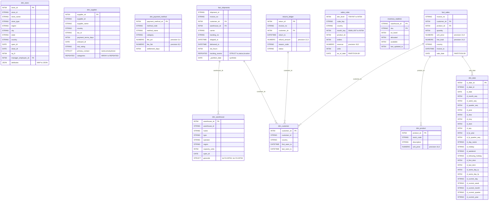

# Data Mapping

## Data Mapping: Hive retail Database → BigQuery `acme-analytics-prod.retail`

All 52 tables and 11 views from the Hive `retail` database map 1:1 into the BQ `acme-analytics-prod.retail` dataset. No tables are split or merged. Column-level type conversions follow locked project rules. Below is the complete mapping.

### ER Diagram (Key Tables)

### Complete Column Mapping (All 52 Tables)

**Dimension Tables (15 tables)**

| Source Table | Target Table | Column Changes | Partition | Cluster |
|---|---|---|---|---|
| retail.dim_date | retail.dim_date | INT cols -> INT64 | none | none |
| retail.dim_customer | retail.dim_customer | TIMESTAMP -> DATETIME (first_seen_ts, last_seen_ts) | none | none |
| retail.dim_product | retail.dim_product | DECIMAL(10,2) -> NUMERIC(10,2) | none | none |
| retail.dim_store | retail.dim_store | INT sq_ft -> INT64; MAP -> JSON (attributes) | none | none |
| retail.dim_supplier | retail.dim_supplier | INT -> INT64 (payment_terms_days); STRUCT preserved; ARRAY STRING -> REPEATED STRING (categories) | none | none |
| retail.dim_employee | retail.dim_employee | all direct mappings | none | none |
| retail.dim_promotion | retail.dim_promotion | ARRAY STRING -> REPEATED (channels); MAP -> JSON (eligibility) | none | none |
| retail.dim_warehouse | retail.dim_warehouse | STRUCT DOUBLE -> STRUCT FLOAT64 (geocode.lat, geocode.lon) | none | none |
| retail.dim_currency | retail.dim_currency | INT minor_unit -> INT64 | none | none |
| retail.dim_geography | retail.dim_geography | DOUBLE -> FLOAT64 (latitude, longitude) | none | none |
| retail.dim_color | retail.dim_color | all direct | none | none |
| retail.dim_size | retail.dim_size | INT sort_order -> INT64 | none | none |
| retail.dim_brand | retail.dim_brand | BOOLEAN -> BOOL | none | none |
| retail.dim_category | retail.dim_category | INT depth,sort_order -> INT64 | none | none |
| retail.dim_payment_method | retail.dim_payment_method | INT settlement_days -> INT64 | none | none |

**Fact Tables (17 tables)**

| Source Table | Target Table | Key Column Changes | Partition | Cluster |
|---|---|---|---|---|
| retail.fact_sales | retail.fact_sales | INT quantity -> INT64; TIMESTAMP -> DATETIME (invoice_ts) | sale_date (DATE) | customer_sk |
| retail.fact_web_session | retail.fact_web_session | TIMESTAMP -> DATETIME; country inlined from partition to regular column | event_date (DATE) | none |
| retail.fact_inventory_movements | retail.fact_inventory_movements | INT quantity -> INT64; add synthetic _partition_date DATE; year/month/day/region inlined as regular columns | _partition_date | sku |
| retail.fact_inventory_snapshot | retail.fact_inventory_snapshot | INT cols -> INT64; TIMESTAMP -> DATETIME | snapshot_date (DATE) | sku |
| retail.fact_returns | retail.fact_returns | INT quantity -> INT64; TIMESTAMP -> DATETIME | return_date (DATE) | none |
| retail.fact_payments | retail.fact_payments | TIMESTAMP -> DATETIME; add synthetic _partition_month DATE; post_year/post_month/payment_method_partition inlined | _partition_month | invoice_no |
| retail.fact_shipments | retail.fact_shipments | TIMESTAMP -> DATETIME; ARRAY STRUCT TIMESTAMP -> ARRAY STRUCT DATETIME (tracking_events); add synthetic _partition_date; ship_year/ship_month/ship_day/carrier_partition inlined | _partition_date | warehouse_sk |
| retail.fact_refunds | retail.fact_refunds | TIMESTAMP -> DATETIME | refund_date (DATE) | none |
| retail.fact_app_clicks | retail.fact_app_clicks | TIMESTAMP -> DATETIME; MAP -> JSON (properties); STRUCT preserved (device); platform_partition inlined | event_date (DATE) | none |
| retail.fact_email_engagement | retail.fact_email_engagement | TIMESTAMP -> DATETIME; ARRAY STRUCT preserved (clicks) | event_date (DATE) | none |
| retail.fact_chat_interactions | retail.fact_chat_interactions | TIMESTAMP -> DATETIME; INT -> INT64; BOOLEAN -> BOOL | start_date (DATE) | none |
| retail.fact_warehouse_picks | retail.fact_warehouse_picks | INT -> INT64; TIMESTAMP -> DATETIME; warehouse_partition inlined | pick_date (DATE) | picker_sk |
| retail.fact_supplier_invoice_lines | retail.fact_supplier_invoice_lines | INT -> INT64; TIMESTAMP -> DATETIME; add synthetic _partition_month; invoice_year/invoice_month inlined | _partition_month | none |
| retail.fact_loyalty_events | retail.fact_loyalty_events | INT points -> INT64; TIMESTAMP -> DATETIME; MAP -> JSON (meta) | event_date (DATE) | none |
| retail.fact_fraud_decisions | retail.fact_fraud_decisions | ARRAY STRING -> REPEATED (rule_signals); TIMESTAMP -> DATETIME | decision_date (DATE) | none |
| retail.fact_promo_redemptions | retail.fact_promo_redemptions | TIMESTAMP -> DATETIME | redemption_date (DATE) | none |
| retail.fact_customer_complaints | retail.fact_customer_complaints | TIMESTAMP -> DATETIME; INT csat_score -> INT64 | created_date (DATE) | none |

**Aggregate Tables (8 tables)**

| Source Table | Target Table | Key Column Changes | Partition | Cluster |
|---|---|---|---|---|
| retail.sales_cube | retail.sales_cube | TINYINT dim_level -> INT64 (R6); SMALLINT month_key -> INT64 (R6) | as_of_date (DATE) | none |
| retail.top_countries_daily | retail.top_countries_daily | TINYINT rank -> INT64 (R6) | none (as_of_date is a regular column) | none |
| retail.agg_daily_sales_by_store | retail.agg_daily_sales_by_store | direct mappings | sale_date (DATE) | none |
| retail.agg_daily_sales_by_product | retail.agg_daily_sales_by_product | direct mappings | sale_date (DATE) | none |
| retail.agg_weekly_customer_ltv | retail.agg_weekly_customer_ltv | INT -> INT64 | week_start_date (DATE) | none |
| retail.agg_monthly_supplier_performance | retail.agg_monthly_supplier_performance | INT -> INT64 | month_start (DATE) | none |
| retail.agg_hourly_warehouse_kpi | retail.agg_hourly_warehouse_kpi | INT -> INT64; add synthetic _partition_date DATE; snapshot_hour inlined as regular STRING column | _partition_date | none |
| retail.agg_daily_carrier_otd | retail.agg_daily_carrier_otd | INT -> INT64 | ship_date (DATE) | none |
| retail.agg_marketing_attribution_cube | retail.agg_marketing_attribution_cube | INT grouping_id -> INT64 | period_date (DATE) | none |
| retail.agg_returns_by_reason_monthly | retail.agg_returns_by_reason_monthly | direct mappings | month_start (DATE) | none |

**ACID Tables (5 tables)**

| Source Table | Target Table | Key Column Changes | Partition | Cluster |
|---|---|---|---|---|
| retail.returns_ledger | retail.returns_ledger | TIMESTAMP -> DATETIME; ORC/transactional dropped | none | return_id |
| retail.acid_customer_address_history | retail.acid_customer_address_history | TIMESTAMP -> DATETIME; BOOLEAN -> BOOL | none | customer_sk |
| retail.acid_supplier_terms_history | retail.acid_supplier_terms_history | INT -> INT64; TIMESTAMP -> DATETIME; BOOLEAN -> BOOL | none | supplier_sk |
| retail.acid_loyalty_points_ledger | retail.acid_loyalty_points_ledger | INT -> INT64; TIMESTAMP -> DATETIME | none | member_id |
| retail.acid_inventory_adjustments_log | retail.acid_inventory_adjustments_log | INT -> INT64; TIMESTAMP -> DATETIME | none | adjustment_id |

**Bridge and SCD-2 Tables (7 tables)**

| Source Table | Target Table | Key Column Changes | Partition | Cluster |
|---|---|---|---|---|
| retail.bridge_product_attribute | retail.bridge_product_attribute | BOOLEAN -> BOOL; INT -> INT64 | none | none |
| retail.bridge_product_supplier | retail.bridge_product_supplier | BOOLEAN -> BOOL; INT -> INT64 | none | none |
| retail.bridge_customer_segment | retail.bridge_customer_segment | direct mappings | snapshot_date (DATE) | none |
| retail.bridge_promo_eligibility | retail.bridge_promo_eligibility | BOOLEAN -> BOOL | load_date (DATE) | none |
| retail.bridge_employee_role | retail.bridge_employee_role | BOOLEAN -> BOOL | none | none |
| retail.dim_employee_history | retail.dim_employee_history | BOOLEAN -> BOOL; add synthetic _partition_year DATE; eff_from_year inlined | _partition_year | none |
| retail.dim_store_history | retail.dim_store_history | INT sq_ft -> INT64; BOOLEAN -> BOOL | none | none |

**Kudu Tables (4 tables)**

| Source Table | Target Table | Key Column Changes | Partition | Cluster |
|---|---|---|---|---|
| retail.kudu_inventory_realtime | retail.inventory_realtime | INT -> INT64; Kudu props dropped | none | warehouse_id, sku |
| retail.kudu_session_state | retail.kudu_session_state | INT cart_items -> INT64; Kudu props dropped | none | session_id |
| retail.kudu_promo_eligibility | retail.kudu_promo_eligibility | BOOLEAN -> BOOL; Kudu props dropped | none | customer_id, promo_id |
| retail.kudu_realtime_price | retail.kudu_realtime_price | Kudu props dropped | none | sku, store_id |

**Views (11 views)**

| Source View | Target View | Key Translation Rules Applied |
|---|---|---|
| vw_daily_sales_by_country | vw_daily_sales_by_country | Green path. Fully qualify refs. |
| vw_weekly_sales_with_running_totals | vw_weekly_sales_with_running_totals | Green path. Fully qualify refs. |
| vw_customer_lifetime_value | vw_customer_lifetime_value | R8: DATEDIFF->DATE_DIFF, DATE_FORMAT->FORMAT_DATE |
| vw_product_performance | vw_product_performance | Green path. |
| vw_monthly_cohort_retention | vw_monthly_cohort_retention | R8: DATE_FORMAT->FORMAT_DATE, MONTHS_BETWEEN->DATE_DIFF, to_date(concat)->PARSE_DATE |
| vw_session_to_order_attribution | vw_session_to_order_attribution | Cross-project ref to acme-lake-prod.raw.mobile_events; R9 interval syntax |
| vw_active_member_panel | vw_active_member_panel | R3: NDV->APPROX_COUNT_DISTINCT; date_sub syntax |
| vw_sales_rollup_by_region | vw_sales_rollup_by_region | R4: WITH ROLLUP->GROUP BY ROLLUP; GROUPING__ID->GROUPING bit-mask |
| vw_category_hierarchy_recursive | vw_category_hierarchy_recursive | R10: WITH RECURSIVE pass-through |
| vw_panel_continuity_score | vw_panel_continuity_score | T4: normalize_country->normalize_country_js UDF-in-JOIN |
| vw_otd_by_carrier_30d | vw_otd_by_carrier_30d | R9: INTERVAL syntax; unix_timestamp->UNIX_SECONDS |

### Synthetic Partition Column Convention
For multi-column partitioned tables, the synthetic column naming convention is:
- `_partition_date DATE` for year/month/day decomposed partitions
- `_partition_month DATE` for year/month decomposed partitions
- `_partition_year DATE` for year-only partitions
ETL pipelines must populate these columns. Original partition columns remain as regular columns for backward-compatible queries.
