# Locked Decisions for Story d6e611f5-7d5b-45fc-912c-539c47c86c00

## Implementation Approach
## Implementation Approach: Hive/Avro DDL → BigQuery DDL Conversion

### Output Structure
Generate BigQuery DDL files organized by dataset under `ddl/acme-lake-prod/`:
- `ddl/acme-lake-prod/raw/` — 20 raw tables + 2 views
- `ddl/acme-lake-prod/staging/` — 11 staging tables + 1 view
- One `.sql` file per table/view
- A master `00-apply-all.sql` that `INCLUDE`s all DDL in dependency order (views after tables)

### Dataset Creation
```sql
CREATE SCHEMA IF NOT EXISTS `acme-lake-prod.raw` OPTIONS(location='US');
CREATE SCHEMA IF NOT EXISTS `acme-lake-prod.staging` OPTIONS(location='US');
```

### DDL Translation Rules Applied (per locked SQL Dialect decision)

**Clauses dropped:**
- `STORED AS PARQUET/TEXTFILE/RCFILE/SEQUENCEFILE` → dropped; all become managed BQ tables
- `ROW FORMAT SERDE '...'` / `ROW FORMAT DELIMITED ...` → dropped
- `LOCATION 'hdfs://...'` or `LOCATION '/user/etl/...'` → dropped
- `TBLPROPERTIES (parquet.compression, skip.header.line.count, serialization.null.format, ignore.malformed.json)` → dropped
- `WITH SERDEPROPERTIES (...)` → dropped
- `avro.schema.url` → dropped; Avro fields resolved from `.avsc` and inlined into BQ DDL

**Type mappings:**
| Hive Type | BigQuery Type | Rule |
|---|---|---|
| `STRING` | `STRING` | Direct |
| `INT` | `INT64` | Direct |
| `BIGINT` | `INT64` | Direct |
| `TINYINT` | `INT64` | R6 NARROW_INT |
| `DECIMAL(p,s)` | `NUMERIC(p,s)` | Direct (p≤38, s≤9 fits NUMERIC) |
| `TIMESTAMP` | `DATETIME` | Per AC2 — Hive TIMESTAMP has no timezone; DATETIME is the semantic match |
| `DATE` | `DATE` | Direct |
| `BOOLEAN` / `boolean` (Avro) | `BOOL` | Direct |
| `DOUBLE` / `double` (Avro) | `FLOAT64` | Direct |
| `MAP<STRING,STRING>` | `JSON` | Per AC2 |
| `STRUCT<...>` | `STRUCT<...>` | Nested fields type-mapped recursively |
| `ARRAY<STRUCT<...>>` | `ARRAY<STRUCT<...>>` (mode REPEATED) | Nested fields type-mapped recursively |
| `ARRAY<STRING>` (Avro) | `ARRAY<STRING>` (mode REPEATED) | Direct |
| Avro `union [null, T]` | T with mode NULLABLE | Standard Avro→BQ |
| Avro `long` + `timestamp-millis` | `TIMESTAMP` | Per AC7 — Avro timestamp-millis maps to BQ TIMESTAMP (not DATETIME) |

### Partition Strategy

Source Hive tables use `PARTITIONED BY (col TYPE)` which adds partition columns outside the main column list. In BQ, partition columns are part of the schema.

| Table | Source Partition | BQ Partition Strategy |
|---|---|---|
| `raw.sales_retail` | `date_ts STRING` | `PARTITION BY DATE(PARSE_DATE('%Y%m%d', date_ts))` — ingestion-time pseudo-column or use a generated column. **Recommendation**: keep `date_ts STRING` in schema, add a generated column `_partition_date DATE AS (PARSE_DATE('%Y-%m-%d', date_ts))`, partition by `_partition_date`. **Alternative**: If `date_ts` is already ISO-date-formatted, use `PARTITION BY DATE(date_ts)` directly. |
| `raw.mobile_events` | `event_date STRING, hour_bucket TINYINT` | Both columns added to BQ schema. `hour_bucket` promoted to INT64 (R6). Partition by `DATE(PARSE_TIMESTAMP(..., event_date))` or keep string + generated column. |
| `raw.inventory_movements` | `year INT, month INT, day INT` | All 3 as INT64. Create generated column `_partition_date DATE AS (DATE(year, month, day))`, partition by `_partition_date`. |
| `raw.shipment_tracking` | `date_ts STRING, carrier_partition STRING` | Partition by date_ts (same pattern as sales_retail). `carrier_partition` becomes a CLUSTER BY column. |
| `raw.warehouse_picks` | `date_ts STRING, warehouse_id_partition STRING` | Partition by date_ts. `warehouse_id_partition` becomes a CLUSTER BY column. |
| Staging tables with `DATE` partition | `order_date DATE`, `load_date DATE`, `snapshot_date DATE`, `score_date DATE` | Direct: `PARTITION BY order_date` etc. — BQ natively supports DATE partitioning. |
| Tables with `date_ts STRING` | Multiple | Same generated-column pattern or `PARTITION BY DATE(PARSE_DATE(...))`. |

### Avro-Backed Tables (Schema Inlining)
`raw.customer_signups` and `raw.fraud_signals` have no column list in Hive DDL — schema comes from `.avsc` files. The BQ DDL will **inline all fields** from the Avro schemas:

**customer_signups** (from `customer_signups-v3.avsc`): 12 fields — `customer_id STRING, email STRING, phone STRING, first_name STRING, last_name STRING, addr_line1 STRING, addr_city STRING, addr_region STRING, addr_country STRING, addr_postal STRING, signup_source STRING, marketing_opt_in BOOL` — all NULLABLE. Plus partition column `signup_date STRING`.

**fraud_signals** (from `fraud_signals-v5.avsc`): 7 fields — `customer_id STRING, signal_type STRING, score FLOAT64, risk_band STRING, reason_codes ARRAY<STRING>, signal_ts TIMESTAMP, vendor STRING` — all NULLABLE. Plus partition column `signal_date STRING`.

### Views Translation
3 views need Hive→BQ SQL translation:

1. **`raw.omniture`** — Simple column projection. Only change: fully qualify table reference to `acme-lake-prod.raw.omniture_logs`.
2. **`staging.v_returns_pending`** — Uses `DATEDIFF(current_date(), to_date(r.requested_at))`. Apply R8: `DATE_DIFF(CURRENT_DATE(), DATE(r.requested_at), DAY) AS days_pending`. Fully qualify `acme-lake-prod.raw.return_authorizations`.
3. **`raw.v_fraud_signals_recent`** — Uses `date_format(date_sub(current_date(), 1), 'yyyyMMdd')`. Apply R8: `FORMAT_DATE('%Y%m%d', DATE_SUB(CURRENT_DATE(), INTERVAL 1 DAY))`.

### Table Naming
All table names preserved as-is (snake_case). No renaming. `raw.*` and `staging.*` map directly to `acme-lake-prod.raw.*` and `acme-lake-prod.staging.*`.

### All Tables/Views (35 tables + 3 views)

**raw (20 tables, 2 views):**
1. sales_retail, 2. omniture_logs, 3. returns_cdc, 4. mobile_events, 5. pos_transactions, 6. inventory_movements, 7. customer_signups (Avro), 8. loyalty_events (RegexSerDe), 9. product_catalog_feed (RCFile), 10. supplier_invoices (SequenceFile), 11. email_campaign_clicks (JsonSerDe), 12. shipment_tracking, 13. return_authorizations, 14. fraud_signals (Avro), 15. warehouse_picks, 16. delivery_routes, 17. driver_logs (JsonSerDe), 18. customer_complaints, 19. chat_transcripts, 20. (reserved for additional if needed)
Views: omniture, v_fraud_signals_recent

**staging (11 tables, 1 view):**
1. cleansed_orders, 2. cleansed_customers, 3. cleansed_products, 4. dedup_clickstream, 5. geocoded_addresses, 6. parsed_loyalty_events, 7. merged_returns_cdc, 8. normalized_carrier_events, 9. fraud_scored, 10. warehouse_kpi_snapshot
View: v_returns_pending

**Note**: The acceptance criteria mention 35 tables but the source DDL yields 31 tables (20 raw + 11 staging). The AC1 list includes 29 named tables. We count exactly what's in the source DDL files. Any discrepancy should be resolved by treating the source HQL files as the authoritative list.

### CLUSTERED BY Translation
`staging.dedup_clickstream` has `CLUSTERED BY (user_id) INTO 16 BUCKETS`. This becomes `CLUSTER BY user_id` in BQ (bucket count is dropped — BQ manages bucket count automatically).

### All Tables Created as Managed
All source tables (even `EXTERNAL TABLE`) become managed BQ tables. The `EXTERNAL` designation was Hive-specific (schema-on-read over HDFS). In BQ, data will be loaded via `bq load` from GCS during the data migration phase.

## Data Mapping
## Data Mapping: Hive raw + staging → BigQuery acme-lake-prod

### Target ER Diagram

```mermaid
erDiagram
    raw_sales_retail {
        STRING invoice_no
        STRING stock_code
        STRING description
        INT64 quantity
        STRING invoice_date
        NUMERIC unit_price "precision 10,2"
        STRING customer_id
        STRING country
        STRING date_ts "partition column"
    }
    raw_omniture_logs {
        STRING col_1
        STRING col_2
        STRING col_60 "60 STRING columns total"
        STRING date_ts "partition column"
    }
    raw_returns_cdc {
        INT64 return_id
        STRING invoice_no
        INT64 customer_sk
        DATETIME return_ts
        NUMERIC refund_amount "precision 12,2"
        STRING reason_code
        STRING status
        STRING op
        DATE snapshot_date "partition column"
    }
    raw_mobile_events {
        STRING event_id
        DATETIME event_ts
        STRING user_id
        STRING app_version
        STRING device_type
        STRING platform
        JSON properties "was MAP STRING STRING"
        STRUCT context "ip country session_id referrer"
        REPEATED items "STRUCT sku qty price"
        STRING event_date "partition column"
        INT64 hour_bucket "was TINYINT, R6 applied"
    }
    raw_pos_transactions {
        INT64 txn_id
        STRING store_id
        STRING register_id
        STRING cashier_id
        STRING customer_id
        STRING invoice_no
        DATETIME txn_ts
        INT64 line_count
        NUMERIC gross_amount "precision 14,2"
        NUMERIC discount_amount "precision 14,2"
        NUMERIC tax_amount "precision 14,2"
        STRING tender_type
        BOOL void_flag
        STRING date_ts "partition column"
    }
    raw_inventory_movements {
        INT64 movement_id
        STRING sku
        STRING warehouse_id
        STRING bin_location
        STRING movement_type
        INT64 quantity
        DATETIME movement_ts
        STRING reference_doc
        STRING operator_id
        STRING reason_code
        INT64 year "partition column"
        INT64 month "partition column"
        INT64 day "partition column"
    }
    raw_customer_signups {
        STRING customer_id
        STRING email
        STRING phone
        STRING first_name
        STRING last_name
        STRING addr_line1
        STRING addr_city
        STRING addr_region
        STRING addr_country
        STRING addr_postal
        STRING signup_source
        BOOL marketing_opt_in
        STRING signup_date "partition column"
    }
    raw_loyalty_events {
        STRING event_ts_str
        STRING member_id
        STRING event_type
        STRING points
        STRING store_id
        STRING tx_id
        STRING meta_raw
        STRING date_ts "partition column"
    }
    raw_product_catalog_feed {
        STRING sku
        STRING supplier_id
        STRING upc
        STRING name
        STRING category
        STRING subcategory
        STRING color
        STRING size
        NUMERIC msrp "precision 10,2"
        NUMERIC cost "precision 10,2"
        DATE available_from
        DATE discontinued_at
        JSON metadata "was MAP STRING STRING"
        STRING feed_date "partition column"
    }
    raw_supplier_invoices {
        STRING invoice_no
        STRING supplier_id
        DATE invoice_date
        DATE due_date
        NUMERIC total_amount "precision 14,2"
        STRING currency
        REPEATED line_items "STRUCT sku qty unit_price"
        STRING raw_xml
        INT64 feed_year "partition column"
        INT64 feed_month "partition column"
    }
    raw_email_campaign_clicks {
        STRING campaign_id
        STRING send_id
        STRING recipient
        DATETIME clicked_at
        STRING click_url
        STRING user_agent
        STRING ip_address
        STRUCT geo "country region city"
        JSON utm "was MAP STRING STRING"
        STRING date_ts "partition column"
    }
    raw_shipment_tracking {
        STRING tracking_no
        STRING carrier
        STRING invoice_no
        STRING customer_id
        DATETIME shipped_at
        DATETIME delivered_at
        STRING status
        STRING last_location
        DATETIME estimated_eta
        STRING date_ts "partition column"
        STRING carrier_partition "partition column"
    }
    raw_return_authorizations {
        STRING rma_id
        STRING customer_id
        STRING invoice_no
        STRING stock_code
        INT64 quantity
        STRING reason_code
        STRING reason_text
        DATETIME requested_at
        BOOL approved
        NUMERIC refund_amount "precision 12,2"
        STRING date_ts "partition column"
    }
    raw_fraud_signals {
        STRING customer_id
        STRING signal_type
        FLOAT64 score
        STRING risk_band
        REPEATED reason_codes "ARRAY of STRING"
        TIMESTAMP signal_ts "Avro timestamp-millis"
        STRING vendor
        STRING signal_date "partition column"
    }
    raw_warehouse_picks {
        INT64 pick_id
        STRING warehouse_id
        STRING bin_id
        STRING sku
        STRING picker_id
        INT64 quantity
        DATETIME picked_at
        INT64 duration_ms
        STRING date_ts "partition column"
        STRING warehouse_id_partition "partition column"
    }
    raw_delivery_routes {
        STRING route_id
        STRING driver_id
        STRING vehicle_id
        INT64 planned_stops
        INT64 actual_stops
        NUMERIC miles_driven "precision 8,2"
        NUMERIC fuel_used "precision 8,2"
        DATETIME start_ts
        DATETIME end_ts
        STRING date_ts "partition column"
    }
    raw_driver_logs {
        STRING driver_id
        DATETIME event_ts
        STRING event_type
        STRUCT gps "lat FLOAT64 lon FLOAT64"
        STRING notes
        JSON extras "was MAP STRING STRING"
        STRING date_ts "partition column"
    }
    raw_customer_complaints {
        STRING complaint_id
        STRING customer_id
        STRING invoice_no
        STRING channel
        STRING severity
        STRING summary
        STRING body
        DATETIME created_at
        DATETIME resolved_at
        INT64 csat_score
        STRING date_ts "partition column"
    }
    raw_chat_transcripts {
        STRING chat_id
        STRING customer_id
        STRING agent_id
        DATETIME started_at
        DATETIME ended_at
        INT64 duration_sec
        INT64 message_count
        STRING transcript
        NUMERIC sentiment "precision 4,3"
        STRING date_ts "partition column"
    }
    staging_cleansed_orders {
        STRING order_id
        STRING customer_id
        STRING invoice_no
        DATETIME txn_ts
        INT64 line_count
        NUMERIC gross_amount "precision 14,2"
        NUMERIC discount "precision 14,2"
        NUMERIC tax "precision 14,2"
        NUMERIC net_amount "precision 14,2"
        STRING tender_type
        STRING source_feed
        DATE order_date "partition column"
    }
    staging_cleansed_customers {
        STRING customer_id
        STRING email_norm
        STRING phone_norm
        STRING first_name
        STRING last_name
        STRING addr_line1
        STRING addr_city
        STRING addr_region
        STRING addr_country
        STRING addr_postal
        FLOAT64 geocoded_lat
        FLOAT64 geocoded_lon
        DATETIME eff_from_ts
        STRING record_hash
        DATE load_date "partition column"
    }
    staging_cleansed_products {
        STRING sku
        STRING upc
        STRING name_norm
        STRING category_norm
        STRING subcategory
        STRING color_norm
        STRING size_norm
        NUMERIC msrp "precision 10,2"
        NUMERIC cost "precision 10,2"
        STRING supplier_id
        BOOL available
        DATE load_date "partition column"
    }
    staging_dedup_clickstream {
        STRING session_id
        STRING user_id
        DATETIME event_ts
        STRING page_url
        STRING referrer_url
        STRING ip
        STRING country
        NUMERIC bot_score "precision 4,3"
        STRING device_type
        STRING date_ts "partition column"
        STRING country_partition "partition column"
    }
    staging_geocoded_addresses {
        STRING raw_addr_hash
        STRING addr_line1
        STRING addr_city
        STRING addr_region
        STRING addr_country
        STRING addr_postal
        FLOAT64 lat
        FLOAT64 lon
        NUMERIC confidence "precision 4,3"
        STRING provider
        DATE load_date "partition column"
    }
    staging_parsed_loyalty_events {
        DATETIME event_ts
        STRING member_id
        STRING event_type
        INT64 points
        STRING store_id
        STRING tx_id
        JSON meta "was MAP STRING STRING"
        STRING date_ts "partition column"
    }
    staging_merged_returns_cdc {
        INT64 return_id
        STRING invoice_no
        INT64 customer_sk
        DATETIME return_ts
        NUMERIC refund_amount "precision 12,2"
        STRING reason_code
        STRING status
        BOOL is_deleted
        DATE snapshot_date "partition column"
    }
    staging_normalized_carrier_events {
        STRING tracking_no
        STRING carrier
        STRING event_type
        DATETIME event_ts
        STRING location_city
        STRING location_region
        STRING location_country
        STRING date_ts "partition column"
    }
    staging_fraud_scored {
        INT64 txn_id
        STRING customer_id
        NUMERIC fraud_score "precision 5,4"
        STRING risk_band
        REPEATED signals "ARRAY of STRING"
        DATETIME scored_at
        DATE score_date "partition column"
    }
    staging_warehouse_kpi_snapshot {
        STRING warehouse_id
        DATETIME snapshot_ts
        INT64 units_in
        INT64 units_picked
        INT64 units_shipped
        NUMERIC pick_rate_uph "precision 8,2"
        INT64 backlog_units
        INT64 avg_pick_ms
        STRING date_ts "partition column"
    }
```



### Column-Level Mapping Table (key transformations only — non-trivial mappings)

| Source Table | Source Column | Source Type | Target Table | Target Column | Target Type | Transformation |
|---|---|---|---|---|---|---|
| raw.mobile_events | hour_bucket | TINYINT | raw.mobile_events | hour_bucket | INT64 | R6 NARROW_INT |
| raw.mobile_events | properties | MAP\<STRING,STRING\> | raw.mobile_events | properties | JSON | MAP→JSON |
| raw.mobile_events | context | STRUCT\<ip,country,session_id,referrer\> | raw.mobile_events | context | STRUCT\<ip STRING,country STRING,session_id STRING,referrer STRING\> | Direct struct mapping |
| raw.mobile_events | items | ARRAY\<STRUCT\<sku,qty INT,price DECIMAL\>\> | raw.mobile_events | items | ARRAY\<STRUCT\<sku STRING,qty INT64,price NUMERIC(10,2)\>\> | INT→INT64 inside struct |
| raw.supplier_invoices | line_items | ARRAY\<STRUCT\<sku,qty INT,unit_price DECIMAL\>\> | raw.supplier_invoices | line_items | ARRAY\<STRUCT\<sku STRING,qty INT64,unit_price NUMERIC(10,2)\>\> | INT→INT64 inside struct |
| raw.product_catalog_feed | metadata | MAP\<STRING,STRING\> | raw.product_catalog_feed | metadata | JSON | MAP→JSON |
| raw.email_campaign_clicks | utm | MAP\<STRING,STRING\> | raw.email_campaign_clicks | utm | JSON | MAP→JSON |
| raw.driver_logs | extras | MAP\<STRING,STRING\> | raw.driver_logs | extras | JSON | MAP→JSON |
| raw.driver_logs | gps | STRUCT\<lat DOUBLE,lon DOUBLE\> | raw.driver_logs | gps | STRUCT\<lat FLOAT64,lon FLOAT64\> | DOUBLE→FLOAT64 |
| staging.parsed_loyalty_events | meta | MAP\<STRING,STRING\> | staging.parsed_loyalty_events | meta | JSON | MAP→JSON |
| raw.fraud_signals | signal_ts | Avro long+timestamp-millis | raw.fraud_signals | signal_ts | TIMESTAMP | Avro logical type → BQ TIMESTAMP |
| raw.fraud_signals | reason_codes | Avro union\[null,array\<string\>\] | raw.fraud_signals | reason_codes | ARRAY\<STRING\> (REPEATED, NULLABLE wrapper) | Avro union→NULLABLE |
| raw.customer_signups | (all fields) | Avro union\[null,T\] | raw.customer_signups | (all fields) | T NULLABLE | Avro schema inlined |
| All TIMESTAMP columns | various | Hive TIMESTAMP | various | various | DATETIME | No-timezone semantics preserved |
| All INT columns | various | Hive INT | various | various | INT64 | Direct promotion |
| All BIGINT columns | various | Hive BIGINT | various | various | INT64 | Direct |
| All DECIMAL(p,s) | various | Hive DECIMAL(p,s) | various | various | NUMERIC(p,s) | Direct (max p=14, s=4 in source) |
| All BOOLEAN | various | Hive BOOLEAN | various | various | BOOL | Direct |
| All DOUBLE | various | Hive DOUBLE | various | various | FLOAT64 | Direct |

### Tables Not Renamed/Split/Merged
All 31 tables map 1:1 from source to target. No tables are split, merged, or renamed. The only structural change is that Hive partition columns (which exist outside the column list in `PARTITIONED BY`) are now inline columns in the BQ schema.

### Destination Codebase
The destination project is empty (only README.md). No existing schema to integrate with. All DDL is net-new.

## Validation
## Validation Strategy

### 1. DDL Execution Validation (AC1)
- Apply all `CREATE TABLE` and `CREATE VIEW` statements against scratch BQ datasets (`raw_scratch`, `staging_scratch`) in the `acme-lake-prod` project
- Every statement must execute with zero errors
- Validation script: `bq query --use_legacy_sql=false < ddl/acme-lake-prod/raw/{table}.sql` for each file
- Master apply script `00-apply-all.sql` runs all DDL in order (tables before views)
- **Automated check**: count of successfully created tables + views must equal 31 + 3 = 34

### 2. Schema Metadata Validation (AC2, AC3, AC4, AC5)
After DDL is applied, run `bq show --schema --format=json acme-lake-prod:raw.{table}` for each table and validate:
- Every source column exists in the BQ schema
- Type mappings are correct per the mapping rules:
  - STRING→STRING, INT→INT64, BIGINT→INT64, TINYINT→INT64 (R6)
  - DECIMAL(p,s)→NUMERIC(p,s), TIMESTAMP→DATETIME, DATE→DATE
  - BOOLEAN→BOOL, DOUBLE→FLOAT64
  - MAP<STRING,STRING>→JSON
  - STRUCT<...>→STRUCT<...> with recursively mapped field types
  - ARRAY<STRUCT<...>>→REPEATED STRUCT with recursively mapped field types

**Specific validations per AC:**
- **AC3**: `raw.mobile_events.hour_bucket` must be `INT64` (not TINYINT — BQ doesn't have TINYINT)
- **AC4**: `raw.mobile_events.properties` = JSON, `.context` = STRUCT<ip STRING, country STRING, session_id STRING, referrer STRING>, `.items` = REPEATED STRUCT<sku STRING, qty INT64, price NUMERIC(10,2)>
- **AC5**: `raw.supplier_invoices.line_items` = REPEATED STRUCT<sku STRING, qty INT64, unit_price NUMERIC(10,2)>

### 3. Storage Format Clause Validation (AC6, AC8)
- **AC6**: Verify that generated DDL for `product_catalog_feed` (was RCFILE), `supplier_invoices` (was SEQUENCEFILE), and `loyalty_events` (was RegexSerDe) contains NO `STORED AS` or `ROW FORMAT SERDE` clauses. Grep the output DDL files for these patterns — must return zero matches.
- **AC8**: Verify no `LOCATION 'hdfs://...'` or `TBLPROPERTIES` with `parquet.compression` / `skip.header.line.count` appear in any generated DDL file.

### 4. Avro Schema Validation (AC7)
- `raw.customer_signups`: all 12 fields from `customer_signups-v3.avsc` present, all NULLABLE, `marketing_opt_in` is BOOL
- `raw.fraud_signals`: 7 fields from `fraud_signals-v5.avsc` present, `reason_codes` is REPEATED STRING (from Avro array), `signal_ts` is TIMESTAMP (from Avro timestamp-millis), `score` is FLOAT64 (from Avro double)

### 5. Partition Strategy Validation (AC9)
- `raw.sales_retail`: must have partition metadata referencing `date_ts`. Verify via `bq show --format=json` that `timePartitioning` or `rangePartitioning` is present.
- All tables with DATE partition columns (`order_date`, `load_date`, `snapshot_date`, `score_date`) should use `PARTITION BY {col}` directly.

### 6. Data-Survival Probes (AC10, AC11, AC12)
These validate data fidelity, not just schema. Run after DDL is applied:

**AC10 — TIMESTAMP precision:**
```sql
-- Insert into BQ scratch table
INSERT INTO raw_scratch.returns_cdc (return_id, return_ts, ...)
VALUES (1, DATETIME '2024-03-15 12:34:56.123456');
-- Note: BQ DATETIME supports microsecond precision (6 digits).
-- Hive TIMESTAMP supports nanosecond (9 digits).
-- '2024-03-15 12:34:56.123456789' → truncated to '2024-03-15 12:34:56.123456' in BQ.
-- This is a KNOWN PRECISION LOSS. Document and validate that 6-digit precision matches.
```
**Risk**: AC10 says "exactly equals" with 9 nanosecond digits. BQ DATETIME only supports 6 digits (microseconds). This AC may need adjustment — either accept microsecond truncation or use `TIMESTAMP` type (which also caps at microseconds in BQ). **Recommendation**: Document the nanosecond truncation as an accepted limitation of BQ. No BigQuery type supports sub-microsecond precision.

**AC11 — DECIMAL precision:**
```sql
-- DECIMAL(38,18) seed: 0.123456789012345678
-- NUMERIC(38,18) in BQ? No — BQ NUMERIC is (38,9). BIGNUMERIC is (76,38).
-- For raw.sales_retail.unit_price which is DECIMAL(10,2), the seed value
-- 0.123456789012345678 has 18 scale digits which exceeds NUMERIC(10,2).
-- The probe tests whether the PLATFORM can preserve 18-scale-digit values.
-- Resolution: use a scratch column typed as BIGNUMERIC for the probe.
-- The actual table column stays NUMERIC(10,2) for normal use.
```
**Action**: Create a scratch probe table with a `BIGNUMERIC` column. Verify 18-digit scale preservation. Document that production columns use `NUMERIC(p,s)` per source schema, and BIGNUMERIC is available if wider precision is needed.

**AC12 — NULL vs empty string:**
```sql
INSERT INTO raw_scratch.sales_retail (description) VALUES (NULL);
INSERT INTO raw_scratch.sales_retail (description) VALUES ('');
SELECT description, description IS NULL AS is_null, description = '' AS is_empty
FROM raw_scratch.sales_retail;
-- Expect: row 1 → NULL, true, null; row 2 → '', false, true
```
BQ natively distinguishes NULL from empty string. This probe should pass with no issues.

### 7. View SQL Validation
- Each view's translated SQL must parse and execute without error
- `staging.v_returns_pending` references `raw.return_authorizations` — cross-dataset reference within the same project (works natively)
- `raw.v_fraud_signals_recent` references `raw.fraud_signals` — same dataset
- `raw.omniture` references `raw.omniture_logs` — same dataset

### Edge Cases & Error Handling
- **Empty table DDL**: All tables are created with schema only (no data). DDL must not fail on empty tables.
- **Reserved words**: Check that no column names conflict with BQ reserved words (e.g., `status` is not reserved in BQ Standard SQL but verify)
- **Column name collisions**: Hive partition columns are added to the BQ column list. Verify no name collision with existing columns.
- **NUMERIC precision bounds**: All source DECIMAL types have p≤14, s≤4, well within BQ NUMERIC(38,9). No BIGNUMERIC needed for table DDL (only for AC11 probe).

### Validation Automation
Generate a validation script (`validate-schema.sh` or `validate-schema.py`) that:
1. Applies all DDL to scratch datasets
2. For each table, reads back schema via BQ API
3. Compares against expected schema (column names, types, modes)
4. Runs data-survival probe inserts + reads
5. Reports pass/fail per acceptance criterion
