# Data Mapping

## Data Mapping: Hive raw + staging → BigQuery acme-lake-prod

### Target ER Diagram

```mermaid
erDiagram
    raw_sales_retail {
        STRING invoice_no
        STRING stock_code
        STRING description
        INT64 quantity
        STRING invoice_date
        NUMERIC unit_price "precision 10,2"
        STRING customer_id
        STRING country
        STRING date_ts "partition column"
    }
    raw_omniture_logs {
        STRING col_1
        STRING col_2
        STRING col_60 "60 STRING columns total"
        STRING date_ts "partition column"
    }
    raw_returns_cdc {
        INT64 return_id
        STRING invoice_no
        INT64 customer_sk
        DATETIME return_ts
        NUMERIC refund_amount "precision 12,2"
        STRING reason_code
        STRING status
        STRING op
        DATE snapshot_date "partition column"
    }
    raw_mobile_events {
        STRING event_id
        DATETIME event_ts
        STRING user_id
        STRING app_version
        STRING device_type
        STRING platform
        JSON properties "was MAP STRING STRING"
        STRUCT context "ip country session_id referrer"
        REPEATED items "STRUCT sku qty price"
        STRING event_date "partition column"
        INT64 hour_bucket "was TINYINT, R6 applied"
    }
    raw_pos_transactions {
        INT64 txn_id
        STRING store_id
        STRING register_id
        STRING cashier_id
        STRING customer_id
        STRING invoice_no
        DATETIME txn_ts
        INT64 line_count
        NUMERIC gross_amount "precision 14,2"
        NUMERIC discount_amount "precision 14,2"
        NUMERIC tax_amount "precision 14,2"
        STRING tender_type
        BOOL void_flag
        STRING date_ts "partition column"
    }
    raw_inventory_movements {
        INT64 movement_id
        STRING sku
        STRING warehouse_id
        STRING bin_location
        STRING movement_type
        INT64 quantity
        DATETIME movement_ts
        STRING reference_doc
        STRING operator_id
        STRING reason_code
        INT64 year "partition column"
        INT64 month "partition column"
        INT64 day "partition column"
    }
    raw_customer_signups {
        STRING customer_id
        STRING email
        STRING phone
        STRING first_name
        STRING last_name
        STRING addr_line1
        STRING addr_city
        STRING addr_region
        STRING addr_country
        STRING addr_postal
        STRING signup_source
        BOOL marketing_opt_in
        STRING signup_date "partition column"
    }
    raw_loyalty_events {
        STRING event_ts_str
        STRING member_id
        STRING event_type
        STRING points
        STRING store_id
        STRING tx_id
        STRING meta_raw
        STRING date_ts "partition column"
    }
    raw_product_catalog_feed {
        STRING sku
        STRING supplier_id
        STRING upc
        STRING name
        STRING category
        STRING subcategory
        STRING color
        STRING size
        NUMERIC msrp "precision 10,2"
        NUMERIC cost "precision 10,2"
        DATE available_from
        DATE discontinued_at
        JSON metadata "was MAP STRING STRING"
        STRING feed_date "partition column"
    }
    raw_supplier_invoices {
        STRING invoice_no
        STRING supplier_id
        DATE invoice_date
        DATE due_date
        NUMERIC total_amount "precision 14,2"
        STRING currency
        REPEATED line_items "STRUCT sku qty unit_price"
        STRING raw_xml
        INT64 feed_year "partition column"
        INT64 feed_month "partition column"
    }
    raw_email_campaign_clicks {
        STRING campaign_id
        STRING send_id
        STRING recipient
        DATETIME clicked_at
        STRING click_url
        STRING user_agent
        STRING ip_address
        STRUCT geo "country region city"
        JSON utm "was MAP STRING STRING"
        STRING date_ts "partition column"
    }
    raw_shipment_tracking {
        STRING tracking_no
        STRING carrier
        STRING invoice_no
        STRING customer_id
        DATETIME shipped_at
        DATETIME delivered_at
        STRING status
        STRING last_location
        DATETIME estimated_eta
        STRING date_ts "partition column"
        STRING carrier_partition "partition column"
    }
    raw_return_authorizations {
        STRING rma_id
        STRING customer_id
        STRING invoice_no
        STRING stock_code
        INT64 quantity
        STRING reason_code
        STRING reason_text
        DATETIME requested_at
        BOOL approved
        NUMERIC refund_amount "precision 12,2"
        STRING date_ts "partition column"
    }
    raw_fraud_signals {
        STRING customer_id
        STRING signal_type
        FLOAT64 score
        STRING risk_band
        REPEATED reason_codes "ARRAY of STRING"
        TIMESTAMP signal_ts "Avro timestamp-millis"
        STRING vendor
        STRING signal_date "partition column"
    }
    raw_warehouse_picks {
        INT64 pick_id
        STRING warehouse_id
        STRING bin_id
        STRING sku
        STRING picker_id
        INT64 quantity
        DATETIME picked_at
        INT64 duration_ms
        STRING date_ts "partition column"
        STRING warehouse_id_partition "partition column"
    }
    raw_delivery_routes {
        STRING route_id
        STRING driver_id
        STRING vehicle_id
        INT64 planned_stops
        INT64 actual_stops
        NUMERIC miles_driven "precision 8,2"
        NUMERIC fuel_used "precision 8,2"
        DATETIME start_ts
        DATETIME end_ts
        STRING date_ts "partition column"
    }
    raw_driver_logs {
        STRING driver_id
        DATETIME event_ts
        STRING event_type
        STRUCT gps "lat FLOAT64 lon FLOAT64"
        STRING notes
        JSON extras "was MAP STRING STRING"
        STRING date_ts "partition column"
    }
    raw_customer_complaints {
        STRING complaint_id
        STRING customer_id
        STRING invoice_no
        STRING channel
        STRING severity
        STRING summary
        STRING body
        DATETIME created_at
        DATETIME resolved_at
        INT64 csat_score
        STRING date_ts "partition column"
    }
    raw_chat_transcripts {
        STRING chat_id
        STRING customer_id
        STRING agent_id
        DATETIME started_at
        DATETIME ended_at
        INT64 duration_sec
        INT64 message_count
        STRING transcript
        NUMERIC sentiment "precision 4,3"
        STRING date_ts "partition column"
    }
    staging_cleansed_orders {
        STRING order_id
        STRING customer_id
        STRING invoice_no
        DATETIME txn_ts
        INT64 line_count
        NUMERIC gross_amount "precision 14,2"
        NUMERIC discount "precision 14,2"
        NUMERIC tax "precision 14,2"
        NUMERIC net_amount "precision 14,2"
        STRING tender_type
        STRING source_feed
        DATE order_date "partition column"
    }
    staging_cleansed_customers {
        STRING customer_id
        STRING email_norm
        STRING phone_norm
        STRING first_name
        STRING last_name
        STRING addr_line1
        STRING addr_city
        STRING addr_region
        STRING addr_country
        STRING addr_postal
        FLOAT64 geocoded_lat
        FLOAT64 geocoded_lon
        DATETIME eff_from_ts
        STRING record_hash
        DATE load_date "partition column"
    }
    staging_cleansed_products {
        STRING sku
        STRING upc
        STRING name_norm
        STRING category_norm
        STRING subcategory
        STRING color_norm
        STRING size_norm
        NUMERIC msrp "precision 10,2"
        NUMERIC cost "precision 10,2"
        STRING supplier_id
        BOOL available
        DATE load_date "partition column"
    }
    staging_dedup_clickstream {
        STRING session_id
        STRING user_id
        DATETIME event_ts
        STRING page_url
        STRING referrer_url
        STRING ip
        STRING country
        NUMERIC bot_score "precision 4,3"
        STRING device_type
        STRING date_ts "partition column"
        STRING country_partition "partition column"
    }
    staging_geocoded_addresses {
        STRING raw_addr_hash
        STRING addr_line1
        STRING addr_city
        STRING addr_region
        STRING addr_country
        STRING addr_postal
        FLOAT64 lat
        FLOAT64 lon
        NUMERIC confidence "precision 4,3"
        STRING provider
        DATE load_date "partition column"
    }
    staging_parsed_loyalty_events {
        DATETIME event_ts
        STRING member_id
        STRING event_type
        INT64 points
        STRING store_id
        STRING tx_id
        JSON meta "was MAP STRING STRING"
        STRING date_ts "partition column"
    }
    staging_merged_returns_cdc {
        INT64 return_id
        STRING invoice_no
        INT64 customer_sk
        DATETIME return_ts
        NUMERIC refund_amount "precision 12,2"
        STRING reason_code
        STRING status
        BOOL is_deleted
        DATE snapshot_date "partition column"
    }
    staging_normalized_carrier_events {
        STRING tracking_no
        STRING carrier
        STRING event_type
        DATETIME event_ts
        STRING location_city
        STRING location_region
        STRING location_country
        STRING date_ts "partition column"
    }
    staging_fraud_scored {
        INT64 txn_id
        STRING customer_id
        NUMERIC fraud_score "precision 5,4"
        STRING risk_band
        REPEATED signals "ARRAY of STRING"
        DATETIME scored_at
        DATE score_date "partition column"
    }
    staging_warehouse_kpi_snapshot {
        STRING warehouse_id
        DATETIME snapshot_ts
        INT64 units_in
        INT64 units_picked
        INT64 units_shipped
        NUMERIC pick_rate_uph "precision 8,2"
        INT64 backlog_units
        INT64 avg_pick_ms
        STRING date_ts "partition column"
    }
```

### Column-Level Mapping Table (key transformations only — non-trivial mappings)

| Source Table | Source Column | Source Type | Target Table | Target Column | Target Type | Transformation |
|---|---|---|---|---|---|---|
| raw.mobile_events | hour_bucket | TINYINT | raw.mobile_events | hour_bucket | INT64 | R6 NARROW_INT |
| raw.mobile_events | properties | MAP\<STRING,STRING\> | raw.mobile_events | properties | JSON | MAP→JSON |
| raw.mobile_events | context | STRUCT\<ip,country,session_id,referrer\> | raw.mobile_events | context | STRUCT\<ip STRING,country STRING,session_id STRING,referrer STRING\> | Direct struct mapping |
| raw.mobile_events | items | ARRAY\<STRUCT\<sku,qty INT,price DECIMAL\>\> | raw.mobile_events | items | ARRAY\<STRUCT\<sku STRING,qty INT64,price NUMERIC(10,2)\>\> | INT→INT64 inside struct |
| raw.supplier_invoices | line_items | ARRAY\<STRUCT\<sku,qty INT,unit_price DECIMAL\>\> | raw.supplier_invoices | line_items | ARRAY\<STRUCT\<sku STRING,qty INT64,unit_price NUMERIC(10,2)\>\> | INT→INT64 inside struct |
| raw.product_catalog_feed | metadata | MAP\<STRING,STRING\> | raw.product_catalog_feed | metadata | JSON | MAP→JSON |
| raw.email_campaign_clicks | utm | MAP\<STRING,STRING\> | raw.email_campaign_clicks | utm | JSON | MAP→JSON |
| raw.driver_logs | extras | MAP\<STRING,STRING\> | raw.driver_logs | extras | JSON | MAP→JSON |
| raw.driver_logs | gps | STRUCT\<lat DOUBLE,lon DOUBLE\> | raw.driver_logs | gps | STRUCT\<lat FLOAT64,lon FLOAT64\> | DOUBLE→FLOAT64 |
| staging.parsed_loyalty_events | meta | MAP\<STRING,STRING\> | staging.parsed_loyalty_events | meta | JSON | MAP→JSON |
| raw.fraud_signals | signal_ts | Avro long+timestamp-millis | raw.fraud_signals | signal_ts | TIMESTAMP | Avro logical type → BQ TIMESTAMP |
| raw.fraud_signals | reason_codes | Avro union\[null,array\<string\>\] | raw.fraud_signals | reason_codes | ARRAY\<STRING\> (REPEATED, NULLABLE wrapper) | Avro union→NULLABLE |
| raw.customer_signups | (all fields) | Avro union\[null,T\] | raw.customer_signups | (all fields) | T NULLABLE | Avro schema inlined |
| All TIMESTAMP columns | various | Hive TIMESTAMP | various | various | DATETIME | No-timezone semantics preserved |
| All INT columns | various | Hive INT | various | various | INT64 | Direct promotion |
| All BIGINT columns | various | Hive BIGINT | various | various | INT64 | Direct |
| All DECIMAL(p,s) | various | Hive DECIMAL(p,s) | various | various | NUMERIC(p,s) | Direct (max p=14, s=4 in source) |
| All BOOLEAN | various | Hive BOOLEAN | various | various | BOOL | Direct |
| All DOUBLE | various | Hive DOUBLE | various | various | FLOAT64 | Direct |

### Tables Not Renamed/Split/Merged
All 31 tables map 1:1 from source to target. No tables are split, merged, or renamed. The only structural change is that Hive partition columns (which exist outside the column list in `PARTITIONED BY`) are now inline columns in the BQ schema.

### Destination Codebase
The destination project is empty (only README.md). No existing schema to integrate with. All DDL is net-new.
